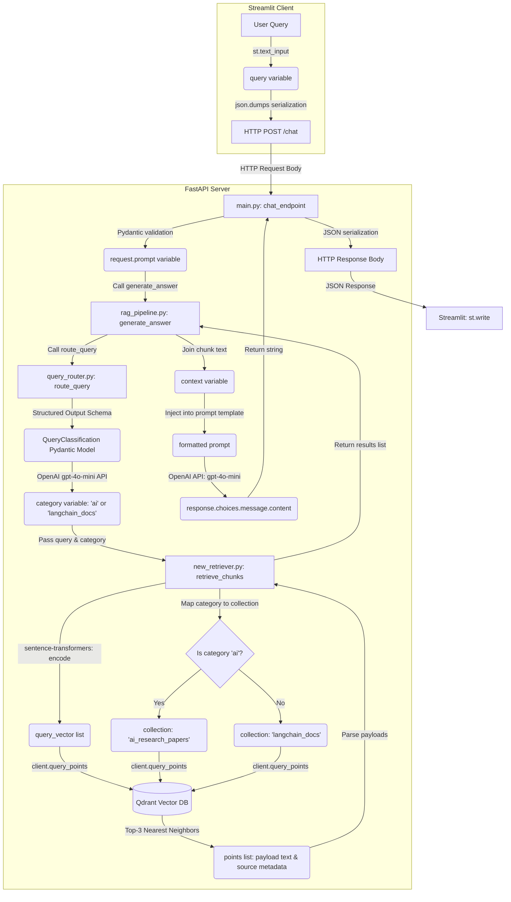

# 🔀 End-to-End Project Data Flow & Pipeline Architecture

This document traces the path of a user's query from the frontend user interface, through our routing and retrieval subsystems, down to the database, LLM generator, and back to the user.

---

## 1. Pipeline Architecture Flowchart

Below is a flowchart mapping the script files, components, and variables through which data is transformed.



---

## 2. Sequence Diagram (Request-Response Lifecycle)

This sequence diagram illustrates the lifecycle of a query and the asynchronous interactions between the system components.

```mermaid
sequenceDiagram
    autonumber
    actor User
    participant App as frontend/app.py (Streamlit)
    participant Main as backend/main.py (FastAPI)
    participant Pipeline as backend/rag_pipeline.py
    participant Router as backend/query_router.py
    participant Retriever as backend/new_retriever.py
    participant Qdrant as Qdrant Vector DB
    participant OpenAI as OpenAI Chat API

    User->>App: Input query string & press Enter
    Active[App]: Display st.spinner("Server is thinking...")
    App->>Main: HTTP POST /chat { "prompt": query }
    Main->>Main: Validate payload via QueryRequest (Pydantic)
    Main->>Pipeline: await generate_answer(prompt)
    
    %% Routing
    Pipeline->>Router: await route_query(query)
    Router->>OpenAI: Request structured completion (gpt-4o-mini)
    OpenAI-->>Router: JSON matching QueryClassification schema
    Router-->>Pipeline: category string ('ai' or 'langchain_docs')
    
    %% Retrieval
    Pipeline->>Retriever: await retrieve_chunks(query, category)
    Note over Retriever: Vectorizes query using sentence-transformers<br/>(embedding_model.py: all-MiniLM-L6-v2)
    Retriever->>Qdrant: query_points(collection, query_vector, limit=3)
    Qdrant-->>Retriever: List of point results (text, metadata payload)
    Retriever-->>Pipeline: results list [ {text, source}, ... ]
    
    %% Generation
    Note over Pipeline: Joins texts to build context variable
    Pipeline->>OpenAI: chat.completions.create(prompt with context)
    OpenAI-->>Pipeline: raw answer content string
    Pipeline-->>Main: answer string
    Main-->>App: HTTP 200 OK { "answer": answer }
    App->>User: Display answer text via st.write()
```

---

## 3. Step-by-Step Execution Lifecycle

### Step 1: Input and Serialization
*   **Location:** [frontend/app.py](file:///d:/projects/simple_rag%20-%20Copy/frontend/app.py)
*   **Variable:** `query` (Type: `str`)
*   **Operation:** The user enters a question into the text input. Streamlit captures it in the `query` variable. The frontend serializes the data into a JSON payload (`{"prompt": query}`) and executes an HTTP POST call to `http://localhost:8000/chat`.

### Step 2: Request Validation and Deserialization
*   **Location:** [backend/main.py](file:///d:/projects/simple_rag%20-%20Copy/backend/main.py)
*   **Variable:** `request` (Type: `QueryRequest` Pydantic schema)
*   **Operation:** FastAPI receives the POST body. The Pydantic validator parses and validates the JSON structure. The query is accessed via `request.prompt` and passed to the orchestration pipeline function: `generate_answer(request.prompt)`.

### Step 3: Intent Routing
*   **Location:** [backend/query_router.py](file:///d:/projects/simple_rag%20-%20Copy/backend/query_router.py)
*   **Variable:** `category` (Type: `str`, strictly limited to `"ai"` or `"langchain_docs"`)
*   **Operation:** The pipeline passes the query to `route_query(query)`. The router constructs an instruction prompt and calls OpenAI's chat completions using Pydantic-enforced **Structured Outputs** (`client.beta.chat.completions.parse`). The LLM returns a validated JSON object, which is deserialized into the `QueryClassification` model. The category is returned to the pipeline.

### Step 4: Semantic Retrieval
*   **Location:** [backend/new_retriever.py](file:///d:/projects/simple_rag%20-%20Copy/backend/new_retriever.py)
*   **Variable:** `query_vector` (Type: `list[float]`), `collection` (Type: `str`)
*   **Operation:** The pipeline invokes `retrieve_chunks(query, category)`. The retriever:
    1.  Encodes the query using the local `embedding_model.py` (which runs the `all-MiniLM-L6-v2` sentence-transformer model producing **384 dimensions**).
    2.  Converts the NumPy encoding into a list using `.tolist()` to generate `query_vector`.
    3.  Maps `category` to the database collection: `"ai"` maps to `"ai_research_papers"`, and any other value (such as `"langchain_docs"`) maps to `"langchain_docs"`.
    4.  Executes an asynchronous query against Qdrant (`client.query_points`).
    5.  Receives the top 3 nearest points, extracting their payload text and original source filename metadata (which was bound to the point during ingestion in `backend/ingest_documents.py`).

### Step 5: Answer Synthesis
*   **Location:** [backend/rag_pipeline.py](file:///d:/projects/simple_rag%20-%20Copy/backend/rag_pipeline.py)
*   **Variable:** `context` (Type: `str`), `prompt` (Type: `str`)
*   **Operation:** The pipeline receives the list of retrieved text segments and formats them into a single string variable `context`. It interpolates `context` and `query` into a prompt template, and sends the prompt to the OpenAI completions endpoint using `gpt-4o-mini`. The model synthesizes the answer, which is parsed and returned to FastAPI.

### Step 6: HTTP Response and Display
*   **Location:** [backend/main.py](file:///d:/projects/simple_rag%20-%20Copy/backend/main.py) & [frontend/app.py](file:///d:/projects/simple_rag%20-%20Copy/frontend/app.py)
*   **Variable:** `result` (Type: `str`)
*   **Operation:** FastAPI wraps the answer in a JSON dictionary `{"answer": result}` and sends it as an HTTP response. The Streamlit client deserializes this JSON stream and renders the final response using `st.write()`.
